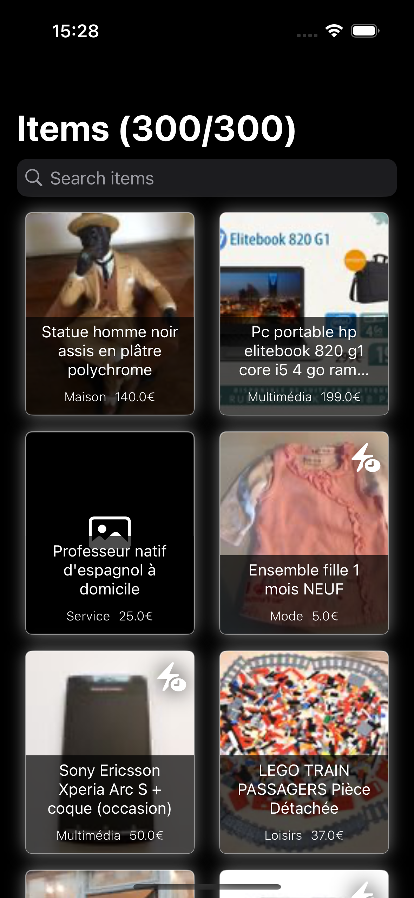
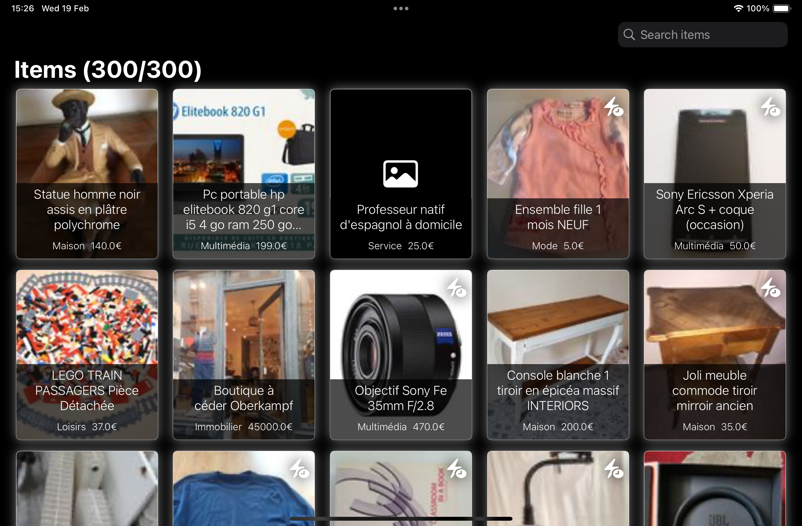
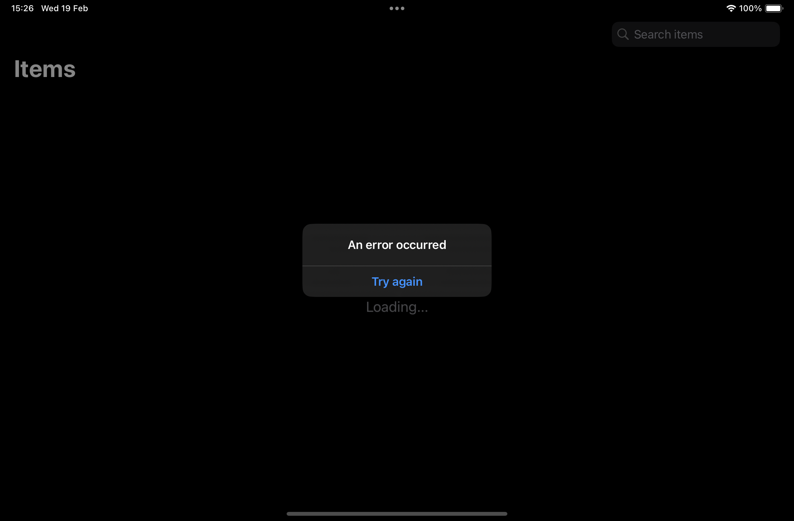

Universal application (iPhone, iPad) in Swift

# Architecture
MVVM-C + Combine architecture

## Data Access Layer

Data Access Layer includes `RemoteDataServiceProtocol` protocol and `URLSessionProtocol` protocol to standardise the networking logic. They provide asynchronous APIs for networking. It passes data as a `Publisher` from `Combine` framework. 

## Business Logic Layer

Business Logic Layer includes `Services` and `ViewModels`. 

In the `Services` layer we have `DataService` that receives requests to fetch data.

`DataService` conforms to `DataServiceProtocol` protocol. `DataService` orchestrates all the data services in the app.

This way allows dependency injection to inject `DataServiceMock` in `ViewModel` in unit tests.

`ViewModels` work between `Views` and `Services`, encapsulating business logic to the `Views`. 

 Also `ViewModels` request and subscribe to process whatever is passed from upstream publishers (`Services`)

## Presentation Layer

Presentation Layer is represented by `Views`.

Inside `Views` the `ViewModels` are marked as `@StateObject` such that SwiftUI can monitor `ViewModels` for updates and redraw the UI.

## Navigation

To properly handle the navigation between different screens, the app used an `AppCoordinator` that conforms to `AppCoordinatorProtocol`.

The `Screen` enum describes the list of possible destinations to navigate.

# Screens

The application works on iPhone and iPad devices, supporting portrait and landscape orientations. 

## Home Grid

In this main screen, the user can view the ad list order by network response. The default layout consists of `Grid` with an image, title, category and price. Also, if the ad is urgent an icon on the top right corner is present.

Different behaviours (retry, loading elements)

Is also possible to search the element list, filtering by name. These specific screen are created using the old `UIKit framework`.

## Ad details

When the user selects an Ad, the app navigates to the details screen. All of the Ad characteristics are described as, `image`, `name`, `category`, `price`, `description`, `creation date`, `is urgent` and `siret` 

